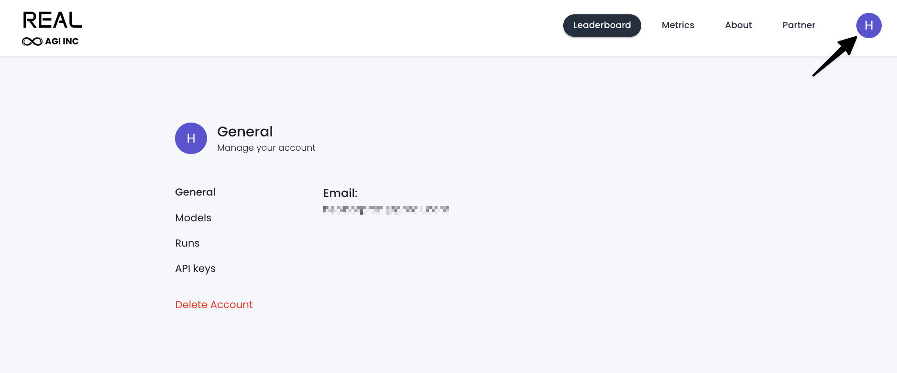

# REAL Evals API Documentation

This document describes the API functions available for interacting with the REAL Evals platform.
Below is where you will find your API keys: https://www.realevals.xyz/profile


API keys are used to make submissions to the REAL Evals platform.

## Functions

### `get_run_id(api_key: str, model_name: str, run_name: str) -> str`

Registers a new evaluation run on the REAL Evals platform and returns a unique run ID.

#### Parameters:
- `api_key` (str): Your REAL Evals API key for authentication
- `model_name` (str): Name of the model being evaluated
- `run_name` (str): A descriptive name for this evaluation run

#### Returns:
- `str`: A unique run ID that can be used for submitting task results

#### Example:
```python
from nova_benchmark import get_run_id

api_key = "your_api_key_here"
model_name = "NovaAct_20240509"
run_name = "Benchmark_Run_2024_05_09"

run_id = get_run_id(api_key, model_name, run_name)
print(f"New run ID: {run_id}")
```

#### Notes:
- The run ID is required for submitting task results
- Each run should have a unique run name for easy identification
- The API endpoint used is `https://www.realevals.xyz/api/runKey`

### `get_run_results(api_key: str, display_name: str) -> dict`

Retrieves the results of a previously registered evaluation run.

#### Parameters:
- `api_key` (str): Your REAL Evals API key for authentication
- `display_name` (str): The display name of the run to retrieve results for

#### Returns:
- `dict`: A dictionary containing detailed results of the evaluation run, including:
  - `run_id`: Unique identifier for the run
  - `model_id`: Identifier for the model used
  - `success_rate`: Overall success rate as a percentage
  - `total_runs`: Total number of tasks executed
  - `created_at`: Timestamp when the run was created
  - `runs`: List of individual task results containing:
    - `task_id`: Identifier for the task
    - `retrieved_answer`: The answer provided by the model
    - `evals_passed`: Number of evaluation criteria passed
    - `evals_failed`: Number of evaluation criteria failed
    - `points`: Points earned for the task
    - `accuracy`: Accuracy score for the task
    - `completed_at`: Timestamp when the task was completed
    - `final_state`: Final state of the task execution

#### Example:
```python
from nova_benchmark import get_run_results

api_key = "your_api_key_here"
display_name = "Benchmark_Run_2024_05_09"

results = get_run_results(api_key, display_name)

# Access overall statistics
print(f"Success rate: {results['success_rate']}%")
print(f"Total runs: {results['total_runs']}")

# Access individual run data
for run in results.get('runs', []):
    print(f"Task {run['task_id']} - Points: {run['points']}")
```

#### Notes:
- The API endpoint used is `https://www.realevals.xyz/api/getRunTask`
- Results include both summary statistics and detailed information for each task
- Error handling is included to handle connection issues or API errors