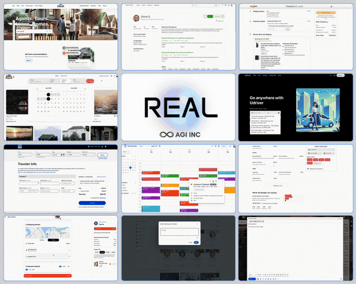

<p align="center">
  
  
  # RealBench: Browser Automation Benchmark with Realistic Web Tasks
</p>



RealBench is a gym environment for evaluating and training AI agents on realistic web tasks. It provides a suite of cloned websites and predefined tasks to benchmark agent performance in a controlled, reproducible environment.

[](https://www.python.org/downloads/)
[](LICENSE)

## Installation and setup

1. Clone the repository
```bash
git clone https://github.com/agi-inc/RealBench
cd RealBench
```

2. Create and activate a virtual environment
```bash
python3 -m venv venv
source venv/bin/activate
```

3. Install the dependencies
```bash
make install
```

4. Install Playwright
```bash
# Force install the latest version of playwright
playwright uninstall --all
python -m pip install --upgrade --force-reinstall playwright
python -m playwright install --with-deps
```

5. Set your .env file
```bash
cp .env.example .env
```

6. Run the interactive launcher
```bash
python interactive.py
```

## Adding Your Own Agent

RealBench makes it easy to integrate your own custom agent. The `custom_agent.py` file provides a template for direct browser control:

```python
def your_agent(browser):
    """
    Implement your agent logic here.

    Args:
        browser: The Playwright browser object

    Returns:
        str: Result message
    """
    # Get the page from the environment
    page = browser.contexts[0].pages[0]

    # YOUR AGENT LOGIC HERE
    # Example:
    # page.goto("https://example.com")
    # page.click("#submit-button")
    # page.fill("#search-box", "my query")

    # Return success message when done
    return "Task completed successfully"
```

The agent receives direct control of the Playwright browser, allowing you to:

1. Use any browser automation logic (clicks, navigation, form filling)
2. Implement your own reasoning loop with LLMs
3. Process page content using your own extraction methods
4. Use any external libraries or APIs

### Running Your Custom Agent

```bash
# Run your agent on a specific task
python custom_agent.py

# Or use the interactive launcher and select "Custom" agent
python interactive.py
```

## Key Features

- **Web Clones**: 11 realistic website replicas for safe, controlled evaluation
- **Task Suite**: 100+ curated tasks across different domains and difficulty levels
- **Multiple Agent Types**: Support for LLM-based, human, and custom agents
- **Standardized Metrics**: Benchmarking system with success rates and efficiency metrics
- **Flexible Environments**: Access to DOM, accessibility tree, and visual observations
- **API Compatibility**: Gym-compatible interface for reinforcement learning

## Quick Start

### Interactive Mode

The easiest way to start is using the interactive launcher:

```bash
python interactive.py
```

This guides you through selecting:

- Agent type (AI, human, custom, etc.)
- Task type or individual task
- Model and observation settings

### Demo Agent

Try the included demo agent (requires OpenAI API key):

```bash
# Install demo requirements
make install-demo

# Set your API key
export OPENAI_API_KEY="your_api_key_here"

# Run the demo agent on a task
python demo_agent/run_demo.py --task_name webclones.udriver-2
```

## Available Tasks

RealBench includes clones of 11 websites with various tasks:

| Website     | Description             | Sample Tasks                             |
| ----------- | ----------------------- | ---------------------------------------- |
| Omnizon     | E-commerce site         | Product search, checkout, filtering      |
| Networkin   | Professional network    | Profile updates, connection requests     |
| UDriver     | Ride sharing            | Booking rides, finding directions        |
| Fly Unified | Airline booking         | Flight searches, reservations            |
| Zilloft     | Real estate             | Property searches, filtering             |
| GoMail      | Email client            | Sending emails, organizing inbox         |
| GoCalendar  | Calendar app            | Creating events, scheduling              |
| DashDish    | Food delivery           | Restaurant search, ordering              |
| StayNB      | Vacation rentals        | Finding accommodations, booking          |
| OpenDining  | Restaurant reservations | Finding restaurants, making reservations |
| TopWork     | Job board               | Job searches, applications               |

## Observation and Action Spaces

### Observations

- **DOM Tree**: HTML structure of the page
- **Accessibility Tree**: Semantic structure for better understanding
- **Screenshots**: Visual representation of the page
- **Task Goals**: Description of the current task objective

### Actions

- **High-level Actions**: Click, type, select, navigate, etc.
- **Python Actions**: Direct Playwright commands for complex interactions
- **OpenAI CUA Actions**: Computer use actions format

## Submitting to the Leaderboard

RealBench allows you to submit your agent's performance to the public leaderboard at [RealEvals.xyz](https://www.realevals.xyz).

To submit your results:

1. **Create an account**: Visit [RealEvals.xyz](https://www.realevals.xyz) and sign up for an account, then visit [your profile page](https://www.realevals.xyz/profile)

2. **Register your model**:

   - Click on "Models" in the navigation
   - Create a new model with a descriptive name and relevant details

3. **Create a run**:

   - Go to the "Runs" section
   - Create a new run associated with your model
   - Copy the generated run ID (this is your unique submission identifier)

4. **Set the environment variable**:

```bash
export RUNID=your_copied_run_id
```

5. **Run your evaluation**:

```bash
# Example with interactive.py
python scripts/interactive.py
```

The system will automatically submit your results to the leaderboard as tasks are completed. You can monitor your progress on the RealEvals dashboard.

**Important:** For your run to be verified and displayed publicly on the leaderboard, you must contact [participate@realevals.xyz](mailto:participate@realevals.xyz) after completing your submission.

## Citing This Work

If you use RealBench in your research, please cite:

```
@misc{RealBench2024,
  author = {AGI Inc},
  title = {RealBench: A Gym Environment for a Miniature Internet},
  year = {2024},
  publisher = {GitHub},
  url = {https://github.com/agi-inc/RealBench}
}
```

## License

This project is licensed under the MIT License - see the [LICENSE](LICENSE) file for details.

## Acknowledgments

This implementation extends [BrowserGym](https://github.com/ServiceNow/BrowserGym) and its demo agent.
