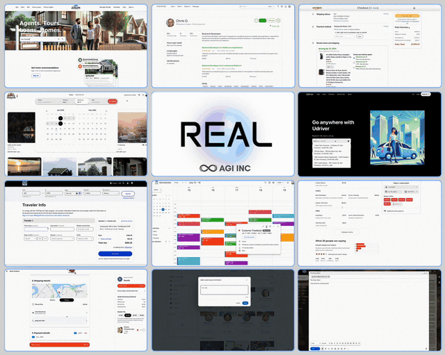
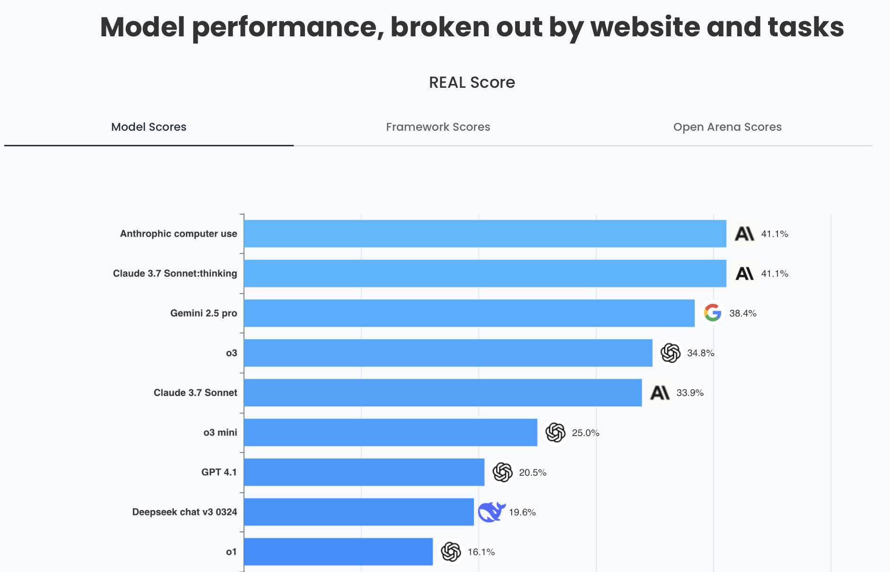

<p align="center">
  <a href="https://theagi.company">
    <h3 align="center">AGI SDK</h3>
  </a>
</p>

AGI SDK is a toolkit for building and evaluating AI agents. It comes with support for the [REAL benchmark](https://realevals.xyz) (Realistic Evaluations for Agents Leaderboard) to evaluate browser-based agents in real world settings.

<p align="center">
  
</p>

## Installation

```bash
# Install from PyPI
pip install agisdk

# Install browser binaries required by Playwright
playwright install --force

# Set your OpenAI API key (required for evaluation)
export OPENAI_API_KEY="your-api-key"
```

For local development, you can install from source:

```bash
# Clone the repository
git clone https://github.com/agi-inc/agisdk.git
cd agisdk

# Install in development mode
pip install -e .
```

## Quick Start

Here's a simple example to get you started for benchmarking an AI agent on the REAL Bench environment:

```python
from agisdk import REAL

# Create a harness with a pre-configured model
harness = REAL.harness(
    model="gpt-4o",
    task_name="webclones.omnizon-1",
    headless=False
)

# Run the experiment
results = harness.run()
```

## Creating Custom Agents

You can create your own custom agent by extending the Agent class:

```python
import dataclasses
from typing import Dict, Tuple, Optional

from agisdk import REAL

# Define custom agent at module level for pickle support
class MyCustomAgent(REAL.Agent):
    def __init__(self) -> None:
        super().__init__()
        self.steps = 0

    def get_agent_action(self, obs) -> Tuple[Optional[str], Optional[str]]:
        """
        Core agent logic - analyze observation and decide on action.

        Returns:
            Tuple of (action, final_message)
            - If action is None, episode ends with final_message
            - If action is not None, the agent takes the action and continues
        """
        self.steps += 1

        # Example of simple decision making based on URL
        current_url = obs.get("url", "")

        # Example logic: Search for a product
        if "google.com" in current_url:
            return "goto('https://www.amazon.com')", None
        elif "amazon.com" in current_url and self.steps == 1:
            return "type('input[name=\"field-keywords\"]', 'wireless headphones')", None
        elif "amazon.com" in current_url and self.steps == 2:
            return "click('input[type=\"submit\"]')", None
        elif "amazon.com" in current_url and self.steps >= 3:
            # Complete the task with a message
            return None, "Found wireless headphones on Amazon!"
        else:
            return "goto('https://www.google.com')", None

    def get_action(self, obs: dict) -> Tuple[str, Dict]:
        """
        Convert agent's high-level action to browsergym action.
        This method is required by the browsergym interface.
        """
        agent_action, final_message = self.get_agent_action(obs)

        if final_message:
            # End the episode with a message
            return f"send_msg_to_user(\"{final_message}\")", {}
        else:
            # Continue with the specified action
            return agent_action, {}

# Create agent arguments class at module level
@dataclasses.dataclass
class MyCustomAgentArgs(REAL.AbstractAgentArgs):
    agent_name: str = "MyCustomAgent"

    def make_agent(self):
        return MyCustomAgent()

# Create harness with custom agent
harness = REAL.harness(
    agentargs=MyCustomAgentArgs(),
    task_name="webclones.omnizon-1",
    headless=False,
)

# Run the task
results = harness.run()
```

## Observation Structure

Your agent gets access to the following observation structure:

```python
{
    'chat_messages': [...],          # History of chat messages
    'goal': "...",                   # Text description of the goal
    'goal_object': [...],            # Structured goal object with text and images
    'open_pages_urls': [...],        # List of open page URLs
    'active_page_index': 0,          # Index of the active page
    'url': "...",                    # Current URL
    'screenshot': np.array(...),     # Screenshot as numpy array
    'dom_object': {...},             # DOM structure
    'axtree_object': {...},          # Accessibility tree
    'extra_element_properties': {...}, # Additional element properties
    'focused_element_bid': "...",    # ID of the focused element
    'last_action': "...",            # Last action performed
    'last_action_error': "...",      # Error from last action (if any)
    'elapsed_time': 0.0,             # Time elapsed in the episode
    'browser': {...}                 # Playwright browser object (for direct control)
}
```

## Available Actions

Actions are specified as strings in the format of function calls. Here are some commonly used actions:

```python
# Navigation
"goto('https://www.google.com')"
"go_back()"
"go_forward()"

# Interaction
"click('element_id')"
"fill('input_id', 'text to enter')"
"press('Enter')"

# Communication
"send_msg_to_user('I found the answer: $42.99')"

# Reporting infeasible tasks
"report_infeasible('The requested item is out of stock')"
```

## Available Tasks

The AGI SDK includes high-fidelity, fully-deterministic websites for agents to explore. These are modern web stack sites (React + Next.js) with rich functionality for core user flows, realistic mock data, and consistent behavior for testing and evaluation.

The benchmark includes these environments:

- **Omnizon** (`webclones.omnizon-*`): Similar to Amazon, for e-commerce shopping tasks
- **DashDish** (`webclones.dashdish-*`): Similar to DoorDash, for food delivery tasks
- **Fly Unified** (`webclones.fly-unified-*`): Similar to United Airlines, for flight booking
- **Staynb** (`webclones.staynb-*`): Similar to Airbnb, for accommodation booking
- **GoCalendar** (`webclones.gocalendar-*`): Similar to Google Calendar, for scheduling
- **GoMail** (`webclones.gomail-*`): Similar to Gmail, for email tasks
- **OpenDining** (`webclones.opendining-*`): Similar to OpenTable, for restaurant reservations
- **NetworkIn** (`webclones.networkin-*`): Similar to LinkedIn, for professional networking
- **Udriver** (`webclones.udriver-*`): Similar to Uber, for ride booking
- **TopWork** (`webclones.topwork-*`): Similar to UpWork, for freelance job marketplace
- **Zilloft** (`webclones.zilloft-*`): Similar to Zillow, for real estate browsing

Each task comes with practical, human-written goals that test an agent's ability to navigate and complete realistic web tasks.

## Harness Configuration

The harness function accepts the following parameters:

```python
REAL.harness(
    # Agent configuration (provide one of these)
    model="gpt-4o",                                # OpenAI models
    model="sonnet-3.7",                            # Anthropic models
    model="openrouter/deepseek/deepseek-chat-v3-0324", # OpenRouter models (with openrouter/ prefix)
    agentargs=MyAgentArgs(),                       # Or provide your own agent arguments

    # Task selection (provide one of these)
    task_name="webclones.omnizon-1",  # Specific task to run
    task_type="omnizon",              # Run all tasks of this type
    task_id=1,                        # Run specific task ID within a type

    # Browser configuration
    headless=False,                   # Whether to show the browser
    max_steps=25,                     # Maximum number of steps
    browser_dimensions=(1280, 720),   # Browser window dimensions

    # Observation options
    use_html=False,                   # Include HTML in observations
    use_axtree=True,                  # Include accessibility tree
    use_screenshot=True,              # Include screenshots

    # Leaderboard submission
    leaderboard=False,                # Whether to submit to leaderboard
    run_id="my_unique_id",            # Unique ID for the submission

    # Execution options
    parallel=False,                   # Run tasks in parallel
    num_workers=4,                    # Number of parallel workers
    use_cache=True,                   # Use cached results when available
    cache_only=False,                 # Only use cached results
    force_refresh=False,              # Force re-running tasks

    # Output options
    results_dir="./results"           # Where to store results
)
```

## Submitting to the Leaderboard

<p align="center">
  
</p>

The AGI SDK allows you to submit your agent's performance to the [RealEvals.xyz](https://realevals.xyz) leaderboard - the Realistic Evaluations for Agents Leaderboard (REAL). This benchmark features fully-deterministic websites with realistic designs and functionality, ensuring consistent and fair agent evaluation.

The REAL benchmark includes:

- High-fidelity websites built with modern web technologies
- Practical goals written by humans
- Fully deterministic environments for consistent evaluation
- Varying difficulty levels (easy, medium, hard categories)

1. **Create an account**: Visit [RealEvals.xyz](https://realevals.xyz) and sign up for an account, then visit your profile page.

2. **Register your model**:

   - Click on "Models" in the navigation
   - Create a new model with a descriptive name and relevant details

3. **Create a run**:

   - Go to the "Runs" section
   - Create a new run associated with your model
   - Copy the generated run ID (this is your unique submission identifier)

4. **Submit your results**:

   ```python
   harness = REAL.harness(
       model="gpt-4o",
       leaderboard=True,              # Enable leaderboard submission
       run_id="your_copied_run_id",   # Your unique run ID
       task_type="omnizon",           # Run all tasks of this type
       headless=True,                 # Typically run headless for submissions
   )

   results = harness.run()
   ```

The harness will automatically set the `RUNID` environment variable when the `leaderboard` flag is set to `True` and a `run_id` is provided.

**Important**: For your run to be verified and displayed publicly on the leaderboard, you must contact participate@realevals.xyz after completing your submission.

## Example Scripts

Check out the example scripts in the repository:

- `example.py`: Demonstrates both built-in and custom agent implementations

## Contributing

We welcome any contributions to the AGI SDK, whether it's submitting an idea, fixing a typo, adding a new guide, or improving an existing one.

If you have ideas for new examples or guides, share them on the [issues page](https://github.com/agi-inc/agisdk/issues).

If you want to directly contribute code, you can fork the repository, make your changes, and submit a pull request.
To avoid duplication of efforts, please review the existing issues and pull requests before contributing.

## Additional Environment Variables

To use models from other providers, set their respective API keys:

```bash
# For Anthropic models (like sonnet-3.7)
export ANTHROPIC_API_KEY="your-anthropic-api-key"

# For OpenRouter models
export OPENROUTER_API_KEY="your-openrouter-api-key"
```

Happy building! 🙌
